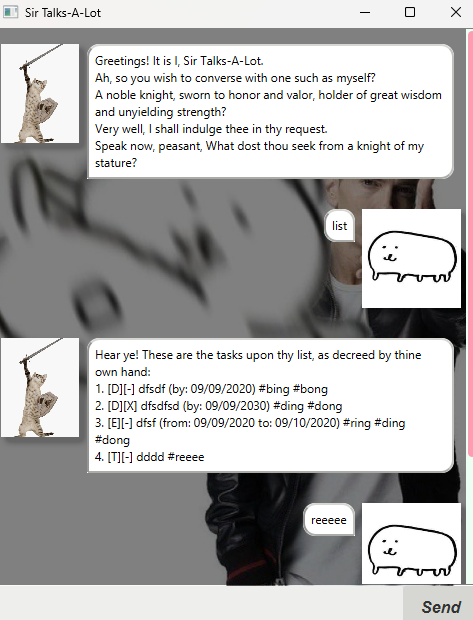

# Sir Talks-A-Lot User Guide



Sir Talks-A-Lot is a chatbot task manager with the personality
of a haughty medieval knight, providing an 
entertaining way to keep track of your tasks.

> Warning: It does talk a lot.


## Adding todos
Sir Talks-A-Lot allows you to add simple tasks, or "todos," to your list.
These are tasks without deadlines or specific timing.

### Usage
Format: `todo <description>`

This will add a todo `[T][-] <description>` to the task list.

### Example
`todo polish armor`

Expected output:
```
Verily, I have inscribed this task upon the list
Let no task go unfulfilled and no duty unrecorded!
    [T][-] polish armor
Thou hast 1 task upon the list. A worthy pursuit!
```


## Adding deadlines
Sir Talks-A-Lot allows you to add deadlines to your list.
These are tasks that have a deadline that they must be delivered by.

### Usage
Format: `deadline <description> /by <yyyy-MM-dd>`

This will add a deadline`[D][-] <description> (by: dd-MM-yyyy)` to the task list.

### Example
`deadline inspect castle walls /by 2025-02-21`

Expected output:
```
Verily, I have inscribed this task upon the list
Let no task go unfulfilled and no duty unrecorded!
    [D][-] inspect castle walls (by: 21-02-2025)
Thou hast 2 task upon the list, each one a worthy pursuit!
```


## Adding events
Sir Talks-A-Lot also allows you to add events to your list. 
These are tasks that starts from and ends at a specific time.

### Usage
Format: `event <description> /from <yyyy-MM-dd> /to <yyyy-MM-dd>`

This will add an event `[E][-] <description> (from: dd-MM-yyyy to: dd-MM-yyyy)` 
to the task list.

### Example
`event attend royal banquet /from 2025-03-15 /to 2025-03-16`

Expected output:
```
Verily, I have inscribed this task upon the list
Let no task go unfulfilled and no duty unrecorded!
    [E][-] attend royal banquet (from: 15-03-2025 to: 16-03-2025)
Thou hast 3 tasks upon the list, each one a worthy pursuit!
```


## Listing tasks
Sir Talks-A-Lot allows you to view all your tasks in a list format. 

### Usage
Format: `list`

This will display all tasks currently in the list in an indexed manner.

### Example
`list`

Expected output:
```
Hear ye! These are the tasks upon thy list, as decreed by thine own hand:
1. [T][-] polish armor
2. [D][-] inspect castle walls (by: 21-02-2025)
3. [E][-] attend royal banquet (from: 15-03-2025 to: 16-03-2025)
```


## Deleting tasks
Sir Talks-A-Lot allows you to delete tasks from your list if they are no longer needed.

### Usage
Format: `delete <task index>`

This will remove the specified task from the list entirely.

### Example
`delete 3`

Expected output:
```
Noted, then. I have seen fit to remove this trivial task.
    [E][-] attend royal banquet (from: 15-03-2025 to: 16-03-2025)
Thou hast 2 tasks upon the list, each one a worthy pursuit!
```


## Marking tasks as Complete
Sir Talks-A-Lot allows you to mark tasks as complete.

### Usage
Format: `mark <task index>`

This will mark the specified task as complete, changing `[-]` to `[X]`.

### Example
`mark 1`

Expected output: 
```
Behold! A task completed! A most noble accomplishment.
[T][X] polish armor
```


## Unmarking tasks as Complete
Sir Talks-A-Lot allows you to unmark tasks, setting them as not yet complete.

### Usage
Format: `unmark <task index>`

This will unmark the specified , changing `[X]` back to `[-]`.

### Example
`unmark 1`

Expected output:
```
Alas, a task left to be conquered. Its time has not yet come to pass.
[T][-] polish armor
```


## Finding Tasks Using a Keyword
Sir Talks-A-Lot allows you to search for tasks using a keyword.

### Usage
Format: `find <keyword>`

This will display all tasks containing the specified keyword.

### Example
`find royal`

Expected output:
```
Here lie the matching tasks in thy list that align
with thy query, as decreed by my boundless wisdom and keen eye!
[E][-] attend royal banquet (from: 15-03-2025 to: 16-03-2025)

```


## Tagging Tasks

Sir Talks-A-Lot allows you to add tags to your tasks as a form of categorization.

### Usage
Format: `tag <task index> #<tag>` with any number of `#<tag>s`

This will add the tag(s) to the specified task.

### Example
`tag 1 #urgent`

Expected output:
```
Verily, 'tis done! The tags are added, by my command and noble favor!
[T][-] polish armor #urgent
```


## Untagging Tasks
Sir Talks-A-Lot allows you to remove tags from your tasks if they are no longer required.

### Usage
Format: `untag <task index> #<tag>` with any number of `#<tag>s`

This will remove the tag(s) from the specified task.

### Example
`untag 1 #urgent`

Expected output:
```
Understood. The tags are no more, vanquished by my command and unyielding strength of will!
[T][-] polish armor
```


## Exiting the Program
When you are done managing your task, Sir Talks-A-Lot allows you to take your leave with grace and dignity.

### Usage
Format: `bye`

Sir Talks-A-Lot will bid you farewell and the program will exit.

### Example
`bye`

Expected output:
```
Hah! A quick departure, is it? Very well, then.
Farewell for now.
```